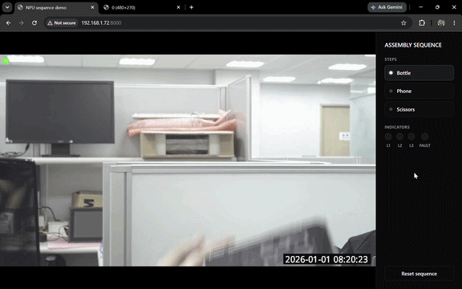
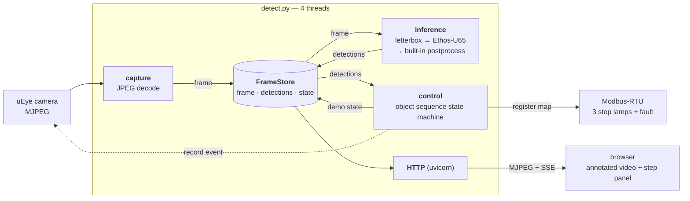

# Object Sequence Demo



A **guided-sequence demo** on Artila's Matrix-800: present everyday objects to
the camera in a fixed order (`bottle → phone → scissors`) while a browser panel
and Modbus lamps track progress. Detection runs on the **Ethos-U65 NPU** with an
off-the-shelf COCO model — no training required.



| python stack | role |
|---|---|
| `requests` | pulls the MJPEG stream and drives the camera's REST API |
| `opencv` | JPEG decode/encode, letterbox, annotation |
| `numpy` | tensor prep and box scaling |
| `tflite_runtime` / `ai-edge-litert` | model inference; the board's build carries the Ethos-U delegate |
| `fastapi` + `uvicorn` | HTTP server: MJPEG stream, JSON state, SSE |
| `pymodbus` + `pyserial` | RTU writes to the lamp gateway |

## Model

`ssd_mobilenet_v2_coco_quant_postprocess.tflite` — stock INT8 SSD-MobileNetV2,
90 COCO classes (`coco_labels_list.txt`).

Its **4 output tensors** mean the decode is **built into the graph** — a
`TFLite_Detection_PostProcess` op does box decoding and NMS (including
cross-class) before the tensors ever reach Python:

| tensor | shape | dtype | meaning |
|---|---|---|---|
| input | `[1,300,300,3]` | uint8 `(scale 1/128, zp 128)` | raw `[0,255]` px |
| out 0 | `[1,N,4]` | float32 | boxes `(ymin,xmin,ymax,xmax)`, normalized |
| out 1 | `[1,N]` | float32 | class ids (0-indexed, background dropped) |
| out 2 | `[1,N]` | float32 | scores, sorted descending |
| out 3 | `[1]` | float32 | detection count |

So `postprocess_builtin()` only thresholds, unletterboxes, and applies a **`+1`
class offset** — `coco_labels_list.txt` line 0 is the `???` background entry, so
ids need shifting by one to index it directly.

Being INT8 it **Vela-compiles for the Ethos-U**; the postprocess op falls back to
the A55 CPU, which is expected and cheap.

## Files

| file | role |
|---|---|
| `detect.py` | main app: capture + inference + control threads + FastAPI server |
| `preprocess.py` | letterbox resize + normalization + dtype/quant conversion |
| `postprocess.py` | built-in-postprocess reader (threshold + class offset + unletterbox) |
| `interpreter.py` | interpreter factory, optional Ethos-U delegate loader |
| `controller.py` | sequence state machine (advance / fault / auto-reset), pure logic |
| `modbus.py` | Modbus-RTU indicator lamps (serial holding registers), called by the control thread |
| `camera.py` | uEye REST client: trigger event recording + fetch clip for the `/log` proxy |
| `web/` | browser UI: `index.html` + `style.css` + `app.js` (vanilla JS + SSE) |
| `config.py` | all config, hardcoded (single source of truth — edit this file) |

## Running

```bash
# dev box (WSL / x86, py3.12) — MODEL_PATH = non-vela build, USE_NPU = False
python3 -m venv .venv && . .venv/bin/activate
pip install -r requirements.txt
python detect.py
```

Vela-compile the INT8 model (`vela ...`) to produce the `_vela.tflite` the board
config expects — only the plain builds are committed here. Then set the board
values in `config.py` (`STREAM_URL`, the `_vela` model, `USE_NPU`/`MODBUS_ENABLE`
on, camera credentials).

Open `http://<board-ip>:8000/`:

| endpoint | returns |
|---|---|
| `GET /` | demo page — video + sequence panel |
| `GET /stream` | annotated MJPEG (`multipart/x-mixed-replace`) |
| `GET /detections` | `{label, class_id, score, box}` |
| `GET /state` | `{steps, current, complete, fault}` |
| `GET /events` | SSE stream of the same state — drives the panel |
| `GET /log/{i}` | camera clip recorded when step `i` completed |
| `POST /reset` | back to step 1, clears the fault and clip links |

## The sequence

Steps are COCO class names in `config.DEMO_STEPS`, in order:

```python
DEMO_STEPS      = ["bottle", "phone", "scissors"]
STEP_REGS       = [0x000D, 0x000E, 0x000F]   # one lamp per step
FAULT_REG       = 0x0010
CONFIRM_FRAMES  = 2
AUTO_RESET_SECS = 20
```

| situation | response |
|---|---|
| expected object held up | step completes, its lamp lights |
| a later object shown early | red banner + fault lamp, sequence freezes |
| wrong object removed | fault clears by itself, sequence resumes |
| an already-completed object reappears | ignored |
| any other COCO class (person, chair, …) | ignored entirely |
| all steps done | complete, then auto-resets after `AUTO_RESET_SECS` |

An object must hold for `CONFIRM_FRAMES` inference cycles before it counts, so a
single-frame misdetection can neither advance the sequence nor trip a fault.
Each completed step triggers a camera clip (uEye event recording), linked from
the step — it finalizes ~`RECORD_POST_SECS` after the trigger and is the raw
`RECORD_STREAM`, so it has no detection boxes.

`MODBUS_ENABLE = False` just logs the lamp writes, so the whole demo runs with no
gateway attached. `python -m pytest tests/` runs the pure-logic tests.

## Gotchas & tuning

- **Never** load a `_vela.tflite` with `USE_NPU = False` — the unresolved
  `ethos-u` op fails to prepare. The dev box runs the plain INT8 model.
- `DEMO_STEPS` strings must match lines in `coco_labels_list.txt` exactly — the
  file uses `phone`, not the `cell phone` you'll see in other COCO label lists.
  Check the file before inventing a step.
- **Tuning:** `INFER_EVERY` (default 3) controls how often the model runs;
  in-between frames reuse the last detections. `CAPTURE_REDUCE` decodes camera
  JPEGs at 1/2 or 1/4 scale, which cuts decode + encode cost sharply. Tune both
  on the board — dev-CPU timings don't transfer. `[infer]` logs per-inference
  latency.
- `SCORE_THRES = 0.5` is higher than the YOLO branches' 0.25 — SSD is chattier at
  low confidence, and a demo wants fewer phantom boxes.
- Capture is **latest-frame-wins** — no backlog, so latency stays bounded if
  inference or the network stalls.
- Lamps are Modbus **holding registers** (`write_register`), not coils —
  `STEP_REGS` / `FAULT_REG` are addresses from the gateway's Li light map. Only
  the control thread writes the bus; `/reset` signals it via `_reset_flush` so
  lamps clear even if detections stall.
- No HTTP auth and `VERIFY_TLS = False` — isolated LAN only.
