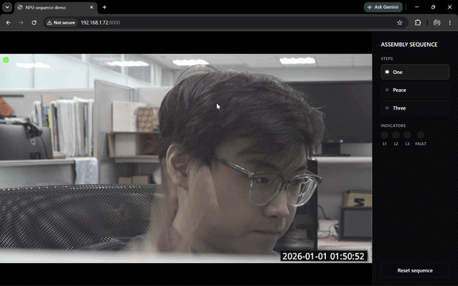
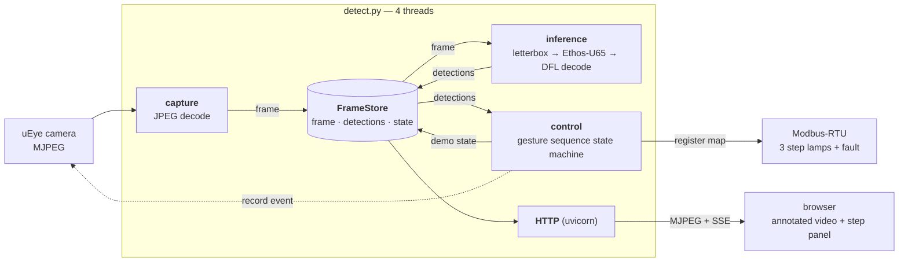

# Gesture Sequence Demo



A **guided-sequence demo** on Artila's Matrix-800: present hand gestures to the
camera in a fixed order (`one → peace → three`) while a browser panel and Modbus
lamps track progress. Detection runs on the **Ethos-U65 NPU**.



| python stack | role |
|---|---|
| `requests` | pulls the MJPEG stream and drives the camera's REST API |
| `opencv` | JPEG decode/encode, letterbox, annotation, NMS |
| `numpy` | YOLO model head decode (DFL, anchors, unletterbox) |
| `tflite_runtime` / `ai-edge-litert` | model inference; the board's build carries the Ethos-U delegate |
| `fastapi` + `uvicorn` | HTTP server: MJPEG stream, JSON state, SSE |
| `pymodbus` + `pyserial` | RTU writes to the lamp gateway |

## Model

`best_int8.tflite` — a YOLO detector trained on **HaGRID**, 10 gesture classes
(`labels.txt`: fist, one, peace, three, four, palm, like, dislike, ok,
no_gesture).

It's a **raw detection head**: 6 outputs, nothing decoded in-graph, 2 tensors per
feature level:

| tensor | shape | dtype | meaning |
|---|---|---|---|
| input | `[1,256,256,3]` | int8 `(scale 1/255, zp -128)` | `[0,1]`-normalized px |
| box ×3 | `[1,G,G,64]` | int8 | DFL logits — 4 sides × 16 bins |
| cls ×3 | `[1,G,G,10]` | int8 | raw class logits (**not** sigmoid'd) |

`G` ∈ {32, 16, 8} → strides 8/16/32, 1344 anchors total. `postprocess_yolo()`
does the whole decode in numpy: sigmoid + threshold, then DFL
softmax-expectation on survivors only, anchor decode, `cv2.dnn.NMSBoxes`,
unletterbox. Thresholding first keeps the normal case at **~0.08 ms** (vs 3.4 ms
for the invoke itself).

`labels.txt` has **no background line**, so `label_offset` is `0`. Being INT8 it
**Vela-compiles for the Ethos-U**; the decode is pure numpy on the A55.

## Files

| file | role |
|---|---|
| `detect.py` | main app: capture + inference + control threads + FastAPI server |
| `preprocess.py` | letterbox resize + normalization + dtype/quant conversion |
| `postprocess.py` | YOLO head decode (sigmoid + threshold, DFL, anchors, NMS, unletterbox) |
| `interpreter.py` | interpreter factory, optional Ethos-U delegate loader |
| `controller.py` | sequence state machine (advance / fault / auto-reset), pure logic |
| `modbus.py` | Modbus-RTU indicator lamps (serial holding registers), called by the control thread |
| `camera.py` | uEye REST client: trigger event recording + fetch clip for the `/log` proxy |
| `web/` | browser UI: `index.html` + `style.css` + `app.js` (vanilla JS + SSE) |
| `config.py` | all config, hardcoded (single source of truth — edit this file) |

## Running

```bash
# dev box (WSL / x86, py3.12) — MODEL_PATH = non-vela build, USE_NPU = False
python3 -m venv .venv && . .venv/bin/activate
pip install -r requirements.txt
python detect.py                       # http://localhost:8000/
```

```bash
# board (i.MX93) — vendor BSP already has tflite_runtime + the Ethos-U delegate,
# so pip only needs pymodbus (pulls pyserial)
sudo mkdir -p /opt/npu
sudo cp *.py /opt/npu/ && sudo cp -r web tflite_model /opt/npu/
```

Then set the board values in `config.py` (`STREAM_URL`, the `_vela` model,
`USE_NPU`/`MODBUS_ENABLE` on, camera credentials) and open
`http://<board-ip>:8000/`.

| endpoint | returns |
|---|---|
| `GET /` | demo page — video + sequence panel |
| `GET /stream` | annotated MJPEG (`multipart/x-mixed-replace`) |
| `GET /detections` | `{label, class_id, score, box}` |
| `GET /state` | `{steps, current, complete, fault}` |
| `GET /events` | SSE stream of the same state — drives the panel |
| `GET /log/{i}` | camera clip recorded when step `i` completed |
| `POST /reset` | back to step 1, clears the fault and clip links |

## The sequence

Steps are gesture labels in `config.DEMO_STEPS`, in order:

```python
DEMO_STEPS      = ["one", "peace", "three"]
STEP_REGS       = [0x000D, 0x000E, 0x000F]   # one lamp per step
FAULT_REG       = 0x0010
CONFIRM_FRAMES  = 3
AUTO_RESET_SECS = 20
```

| situation | response |
|---|---|
| expected gesture held | step completes, its lamp lights |
| a later gesture shown early | red banner + fault lamp, sequence freezes |
| wrong gesture removed | fault clears by itself, sequence resumes |
| an already-completed gesture reappears | ignored |
| a class not in `DEMO_STEPS` (e.g. `no_gesture`) | ignored entirely |
| all steps done | complete, then auto-resets after `AUTO_RESET_SECS` |

A gesture must hold for `CONFIRM_FRAMES` inference cycles before it counts, so a
single-frame misdetection can neither advance the sequence nor trip a fault.
Each completed step triggers a camera clip (uEye event recording), linked from
the step — it finalizes ~`RECORD_POST_SECS` after the trigger and is the raw
`RECORD_STREAM`, so it has no detection boxes.

`MODBUS_ENABLE = False` just logs the lamp writes, so the whole demo runs with no
gateway attached. `python -m pytest tests/` runs the pure-logic tests.

## Gotchas & tuning

- **Never** load a `_vela.tflite` with `USE_NPU = False` — the unresolved
  `ethos-u` op fails to prepare. The dev box runs the plain INT8 model.
- `DEMO_STEPS` strings must match lines in `labels.txt` exactly — they're what
  the model emits.
- **Tuning:** `INFER_EVERY` (default 3) controls how often the model runs;
  in-between frames reuse the last detections. `CAPTURE_REDUCE` decodes camera
  JPEGs at 1/2 or 1/4 scale, which cuts decode + encode cost sharply. Tune both
  on the board — dev-CPU timings don't transfer. `[infer]` logs per-inference
  latency.
- Capture is **latest-frame-wins** — no backlog, so latency stays bounded if
  inference or the network stalls.
- Lamps are Modbus **holding registers** (`write_register`), not coils —
  `STEP_REGS` / `FAULT_REG` are addresses from the gateway's Li light map. Only
  the control thread writes the bus; `/reset` signals it via `_reset_flush` so
  lamps clear even if detections stall.
- No HTTP auth and `VERIFY_TLS = False` — isolated LAN only.
