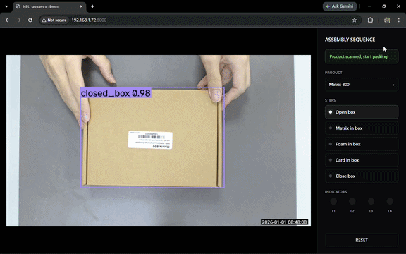
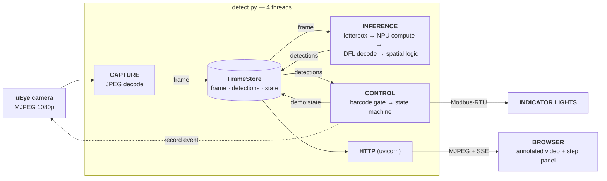

# Complete Packaging Demo



A **guided packing demo** on Artila's Matrix-800: scan the box's barcode, then
place matrix → foam → card inside and close it, while a browser panel and four
Modbus lamps track progress. Detection runs on the **Ethos-U65 NPU**.

## Architecture



| Python stack | role |
|---|---|
| `requests` | pulls the MJPEG stream and drives the camera's REST API |
| `opencv` | JPEG decode/encode, letterbox, annotation, NMS |
| `numpy` | YOLO model head decode (DFL, anchors, unletterbox) |
| `tflite_runtime` / `ai-edge-litert` | model inference; the board's build carries the Ethos-U delegate |
| `zxing-cpp` | Code 128 decoding |
| `fastapi` + `uvicorn` | HTTP server: MJPEG stream, JSON state, SSE |
| `pymodbus` + `pyserial` | RTU writes to the lamp gateway |

## Model

`box_detector_y8n_int8_320.tflite` — a YOLOv8n detector, 5 custom classes
(`box_detector.txt`)

It's a **raw detection head**: 6 outputs, nothing decoded in-graph, 2 tensors per
feature level:

| tensor | shape | dtype | meaning |
|---|---|---|---|
| input | `[1,320,320,3]` | int8 `(scale 1/255, zp -128)` | `[0,1]`-normalized px |
| box ×3 | `[1,G,G,64]` | int8 | DFL logits — 4 sides × 16 bins |
| cls ×3 | `[1,G,G,5]` | int8 | raw class logits (**not** sigmoid'd) |

`G` ∈ {40, 20, 10} → strides 8/16/32. `postprocess_yolo()` does the whole decode
in numpy: sigmoid + threshold, then DFL softmax-expectation on survivors only,
anchor decode, `cv2.dnn.NMSBoxes`, unletterbox. Thresholding first keeps the
normal case at **~0.08 ms** (vs the invoke itself).

NMS is **class-aware** (boxes offset by class id before NMS). This matters for
this model: items sit *inside* the box, so a class-agnostic pass deletes whichever
of `matrix`/`open_box` scores lower.

`box_detector.txt` has **no background line**, so `label_offset` is `0`. Being
INT8 it **Vela-compiles for the Ethos-U**; the decode is pure numpy on the A55.

## Files

| file | role |
|---|---|
| `detect.py` | main app: capture + inference + control threads + FastAPI server |
| `preprocess.py` | letterbox resize + normalization + dtype/quant conversion |
| `postprocess.py` | YOLO head decode (sigmoid + threshold, DFL, anchors, class-aware NMS, unletterbox) |
| `spatial.py` | containment gate — an item counts only when it's inside its container |
| `barcode.py` | Code 128 reader (zxing-cpp) for the closed-box crop |
| `interpreter.py` | interpreter factory, optional Ethos-U delegate loader |
| `controller.py` | sequence state machine (load product / advance / error / regress), pure logic |
| `modbus.py` | Modbus-RTU indicator lamps (serial holding registers), called by the control thread |
| `camera.py` | uEye REST client: trigger event recording + fetch clip for the `/log` proxy |
| `web/` | browser UI: `index.html` + `style.css` + `app.js` (vanilla JS + SSE) |
| `config.py` | all config, hardcoded (single source of truth — edit this file) |

## Running

```bash
# dev box (WSL / x86, py3.12) — MODEL_PATH = non-vela, USE_NPU = False
python3 -m venv .venv && . .venv/bin/activate
pip install -r requirements.txt
python detect.py
```

Then set the board values in `config.py` (`STREAM_URL`, the `_vela` model,
`USE_NPU`/`MODBUS_ENABLE` on, camera credentials).

Open `http://<board-ip>:8000/`:

| Endpoints |  |
|---|---|
| `GET /` | demo page — video + sequence panel |
| `GET /stream` | annotated MJPEG (`multipart/x-mixed-replace`) |
| `GET /detections` | `{label, class_id, inside, score, box}` |
| `GET /state` | `{steps, current, loaded, complete, error, misplaced, scan, lamps}` |
| `GET /events` | SSE stream of the same state — drives the panel |
| `GET /log/{i}` | camera clip recorded when step `i` completed |
| `POST /reset` | drop the product, wait for a new barcode |

## The sequence

**The barcode is the starting gate.** Until a closed box is scanned the panel is
blank. The scan loads that product's recipe from `config.SPECS`; Reset clears it.
An unknown code shows "not in catalog" and nothing runs — no verified recipe, no
packing.

```python
"C642660001": {
  "sku": "Matrix-800", "name": ..., "features": [...],
  "steps": [
    {"title": "Open box",      "label": "open_box", "container": None,       "state": "1000"},
    {"title": "Matrix in box", "label": "matrix",   "container": "open_box", "state": "1100"},
  ]}
```

| key | meaning |
|---|---|
| `label` | model class that satisfies the step |
| `container` | must be **fully inside** a detection of this class, or it doesn't count |
| `state` | lamp pattern once the step is done, one bit per `MODBUS_REGISTERS` |

So each SKU carries its own bill of materials and lamp map, with no code change;
every other key is rendered generically in the sidebar card.

| situation | response |
|---|---|
| wrong item placed in the box | red banner, sequence freezes until removed |
| item visible but not inside | amber "not inside the box" hint |
| placed item taken back out | steps back, dims that lamp |
| item merely visible, on the bench | ignored entirely |
| box still closed after scanning | fine — that's the start state |
| box closed early, mid-sequence | wrong item |

Detections must hold `CONFIRM_FRAMES` cycles to count and be missing
`REGRESS_FRAMES` to un-count. Regression only re-checks the **last** completed
step, and only while the box is in view — otherwise occlusion would undo correct
work. Each completed step triggers a camera clip, linked from the step.

`MODBUS_ENABLE = False` just logs the lamp writes, so the whole demo runs with no
gateway attached. `python -m pytest tests/` runs the pure-logic tests.

## Gotchas & tuning

- **The stream must be 1080p.** At 720p the barcode is ~65×15 px at demo distance
  and no upscaling recovers it.
- **Never** load a `_vela.tflite` with `USE_NPU = False` — the unresolved
  `ethos-u` op fails to prepare.
- **Barcode:** run `python tests/tune_barcode.py` on the board with the box in
  frame. It sweeps `BARCODE_CROP` × `BARCODE_SCALE` and ranks by **worst-case**
  time — that's what occupies the control thread. `[barcode] slow read:` warns
  above 200 ms.
- **Lag:** `PREVIEW_SCALE` shrinks the browser preview before encoding, and encode
  cost is per connected viewer. `INFER_EVERY` controls how often the model runs.
- Frames from `FrameStore` are **read-only and shared, not copied** — anything
  that draws must resize or copy first. `put_frame` marks them non-writeable so a
  violation raises immediately.
- Lamps are Modbus **holding registers** (`write_register`), not coils. No fault
  lamp — wrong items are a UI error only. Only the control thread writes the bus;
  `/reset` signals it via `_reset_flush` so lamps clear even if detections stall.
- No HTTP auth and `VERIFY_TLS = False` — isolated LAN only.
